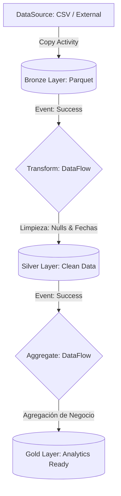

# Informe de Arquitectura: Plataforma de Datos y Tiempo Real en Azure

## 1. Diseño y Patrón Arquitectural
Se ha elegido implementar una **Arquitectura Lambda** integrada con una organización de datos **Medallion Architecture (Bronze, Silver, Gold)**.

### Por qué Lambda y Medallion:
- **Lambda:** Permite procesar de forma unificada pero separada en capas subyacentes datos de muy baja latencia (Event Hubs -> Stream Analytics) y datos de alto volumen procesados periódicamente (Data Factory Batch Pipelines). En la capa de servicio (Synapse Analytics) ambos mundos pueden intersecarse.
- **Medallion:** Garantiza que los ingenieros de datos analicen linajes de información lógicamente puros:
  - `Bronze`: Ingreso crudo "tal cual" (Json empaquetado, CSV, raw stream events).
  - `Silver`: Limpieza, enriquecimiento y estandarización a un modelo de negocio estable (eliminación de nulos, estructuración).
  - `Gold`: Agregaciones a nivel métrica de negocio (por hora, por dispositivo, listos para BI).

## 2. Ingesta y Procesamiento de Eventos (Speed Layer)
Para la telemetría simulada en tiempo real de los dispositivos IoT:
- **Azure Event Hubs:** Se usa por su capacidad de retención de mensajes y tolerancia a fallos. Se configuraron 4 particiones para permitir alto rendimiento en paralelo conforme crece la solución.
- **Azure Stream Analytics (ASA):** Resulta idóneo para computación en stream "SQL-like" administrada. 
  - *Decisión:* Las métricas se agrupan en una *Tumbling Window* de 1 minuto para dar ventanas sin solapamiento (precisión matemática perfecta en las agregaciones por minuto).
  - *Alertas:* Se definió una rama de output múltiple. Si la métrica instantánea supera el threshold (`temperatura > 45.0`), dispara un evento crudo de "WARNING" a la ruta `silver/alerts/`.

## 3. Data Lake (ADLS Gen2)
- Se activó el `Hierarchical Namespace` para garantizar búsquedas veloces tipo sistema de archivos y evitar escaneos de blobs desordenados.
- **Lifecycle Management:** Los datos granulares de alta resolución en la capa `Bronze` pierden valor consultivo rápidamente por lo tanto su costo se mitiga eficientemente al pasarlos a "Cool" (después de 90 días) para luego resguardarlos legalmente en "Archive" (>365 días).

## 4. Orquestación y Transformación Lote (Batch Layer)
- **Azure Data Factory:** Eje orquestador del *Batch Processing* que importa repositorios históricos unificados (ejemplo CSV) hacia la tabla Bronze. 
- Transformaciones se configuran de manera lógica usando conjuntos genéricos para Parquet/Delta, asegurando alta compresión y metadata enriquecida al pasar a Silver y finalmente Gold.
- **Trigger**: Se configuró de manera automatizada para ejecutarse a las 2:00 AM (Schedule).

### Diagrama de Flujo del Pipeline (ADF)

## 5. Plataforma Analítica (Serving Layer)
- **Synapse Serverless SQL Pool:** Esta es la principal decisión en cuanto a costos. Un Dedicated SQL Pool posee cuotas por hora por recursos computacionales. Al tener los datos estructurados impecablemente en formato *Parquet* dentro de ADLS Layer Gold/Silver, el modelo "OpenRowSet / Serverless" es idóneo para pagar exclusivamente por Terabyte consultado por el equipo BI sin mantener un clúster corriendo 24/7.
- **Monitoreo:** El *Diagnostics Settings* en Synapse proveerá visibilidad a Azure Log Analytics donde se podrán generar alarmas de costos en caso de consultas no optimizadas.

## 6. Integración y Despliegue (CI/CD)
El código de recursos (`*.tf`) mantiene el estado de la nube de forma declarativa. Mediante Azure Pipelines, protegemos que ningún cambio infraestructural manual corrompa la plataforma. Se utiliza un pipeline multi-etapa (*Terraform Plan* validado automáticamente, seguido de un *Terraform Apply* manual/aprobado) previniendo incidentes operacionales.
